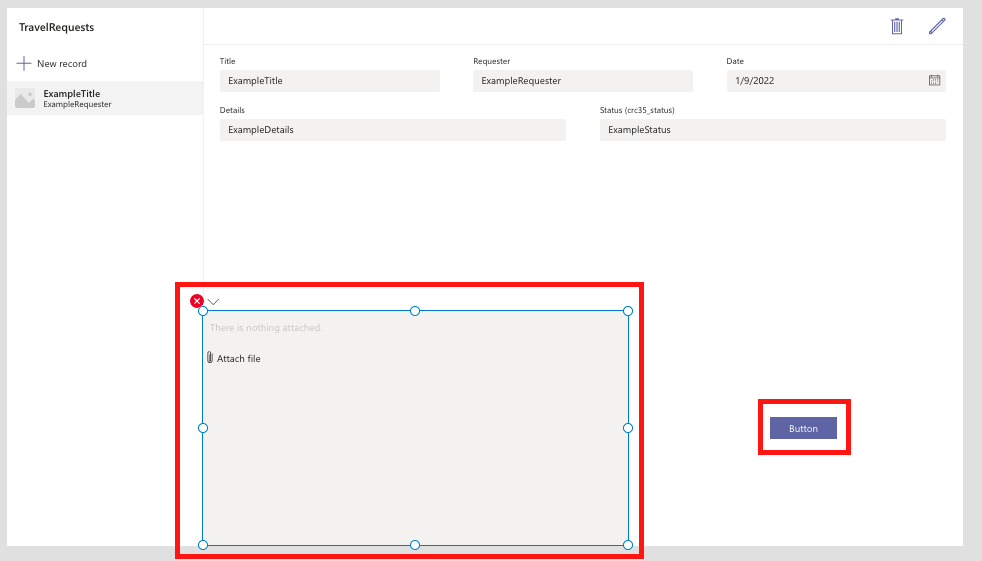

# ローカルで選択したエクセルのテーブルを Dataverse for Teams へ追加する Power Apps アプリケーションの作成 

## このドキュメントの内容
エクセル ファイルにあるテーブルの内容を、既存の Dataverse for Teams へ追加する Power Apps アプリケーションの作成手順 (非公式) です。

Power Apps の知見がなくとも実装出来るようスクリーンショットを盛りに盛っています。

## 前提
- ローカルで選択するエクセル ファイルがテーブルを持っている事
- Microsoft 365 のライセンスを持っている事
- 追加コストを抑えるべく Microsoft 365 ライセンスのみで実現させたい都合上、Dataverse for Teams を使用する事
- macOS を使用している都合上、スクリーンショットは macOS のものとなる事 (他 OS も Power Apps がサポートされている OS やブラウザをご利用の場合は同手順で実現可能と思われます。)

## 実装するアプリケーションの動作
1. [Power Apps] ボタンクリックにより添付ファイル コントロールを動作させ、ファイル ブラウザを起動
2. [Power Apps] 画像コントロールを媒介としてエクセル ファイルを Datauri 型のデータへ変換
3. [Power Automate] Datauri 型のデータをエクセル ファイルへ復元、テーブルを取得
4. [Power Automate] テーブルの内容を Dataverse for Teams へ追加

## 実装
以下実装内容です。

## 0. Dataverse for Teams へアップロード出来るようなエクセル ファイルと Dataverse の準備
### 0.1 エクセル ファイルの準備
まず初めに、Dataverse for Teams へ追加するデータの元となるエクセル ファイルを準備します。

> Power Automate のフローを設定する際、どこからどこまでのデータを Dataverse for Teams へ追加するかを指定するためにテーブルを設定します。

ファイル名は `TableTemplateForDataverseForTeams.xlsx` としました。

作成したファイル内に、データを含む表を作成します。出張を想定して以下の項目としました。
- Title
- Requester
- Date
- Details
- Status

元データができたので、これをテーブルにします。「ホーム」タブの「テーブルとして書式設定」から選択します。今回は Excel Online を使用しています。

以下のダイアログが出てきたのでそのまま OK を押します。

エクセルのテーブルとなりました。

このままでも良いのですが、Power Automate からテーブルを指定する必要があるので、テーブル名を決めておきます。「テーブルデザイン」タブよりテーブル名を指定できます。`TravelRequestForm` としました。

エクセル ファイルの中にテーブルを用意できました。

### 0.2 Dataverse for Teams の準備
次に、データの追加先の Dataverse for Teams を用意します。

Teams の 「...」タブより、Power Apps を検索して選択します。

「Build」タブより、「See all」を選択します。

Power Apps の一覧画面が表示されます。Power Apps でアプリケーションを作成された事がある方にはお馴染みの画面ですね。私はあれこれ試してしまっているので過去のフローやテーブルが一覧に見えています。

Dataverse for Teams を作成するために、Power Apps アプリケーションを作成します。今回はコンピューターからのファイル アップロードを想定しているので、「Tablet form factor」を選択しました。

Power Apps アプリケーションが新規で作成されるので、名前をつける必要があります。この Git リポジトリの名前を設定しました。

Dataverse for Teams を設定するためには、開始した画面の「With data」をクリックし、「Create new table」を選択します。

`TravelRequest` という名前を設定しました。

`TravelRequest` と言う名前の Dataverse for Teams が設定されました。データを編集できる画面になります。0.1 でエクセル ファイルに指定した項目 (Title, Requester, Date, Details, Status) と、例としてその項目に対するレコードを追加して「Close」を押すと次のようになります。

## 1. [Power Apps] ボタンクリックにより添付ファイル コントロールを動作させ、ファイル ブラウザを起動
Power Apps アプリケーションに添付ファイルをアップロードさせる機能を作成します。

左ペインには `RightContainer1` があると思います。今回は 1 レコードデータ項目が少ないので、この画面で簡潔させるべく `RightContainer1` をクリックし、下幅を狭めてボタンを追加するスペースを用意します。

ボタンを追加します。

添付ファイル コントロールを追加するため、まず Edit Form (編集フォーム) を追加します。

次に、添付ファイル コントロールを追加するため、任意の SharePoint リストを作成します。

> ここで SharePoint リストを作成する理由ですが、私が手元で試した際 Teams 上の Power Apps から添付ファイル コントロールを獲得する方法が SharePoint リストを Data source とした Edit form から取り出す方法のみ見つけられたため、この手順を追加しました。他にも良い方法があると信じたいです。

添付ファイル コントロールを追加した後は使いませんが、`TravelRequestList` としました。リストの中身は空で構いません。

作成した `TravelRequestList` を参照するため、左ペインの「Add data」より SharePoint を検索します。

すると下の図のように、Power Apps と連携する SharePoint を選択可能となります。

選択すると、今度はどのリストのデータを参照するかを問われます。ここで先程作成した `TravelRequestList` を選択します。

最後に、先に追加しておいた編集フォームを選択し、「Data source」より `TravelRequestList` を選択すると添付ファイルコントロールが付属した Edit form が得られます。

Edit form のみ必要なので左ペインの添付ファイル コントロールを選択後、Command (または Control) + C を押下してクリップボードへコピーします。(画像内 `DataCardValue2`)

クリップボードへコピーしたまま、左ペイン `Screen1` を選択し、Command (または Control) + V にて `Screen1` 上に添付ファイル コントロールを貼り付けます。

添付ファイル コントロールを得られたため、Edit form は不要なので左ペインより削除します。

添付ファイル コントロールとボタンの位置を他と重ならないように配置し直しました。

Edit form より無理やり添付ファイル コントロールを取り出し、`Screen1` へ貼り付けたため、App Checker より 7 件のエラーが出ていますのでこれを削除します。

削除方法としては、エラーをクリックすると不正な式の内容が出てくるので、全件式を削除します。

添付ファイルコントロールの名前を変更します。`AttachmentControl1` としました。

## 2. [Power Apps] 画像コントロールを媒介としてエクセル ファイルを Datauri 型のデータへ変換

Datauri 型のデータを取り出すために媒介とする画像コントロールを設定します。デフォルトでは `Image1` となりました。

`Image1` を選択し、Image プロパティに `Last(AttachmentControl.Attachments).Value` と入力します。
> `AttachmentControl.Attachments` は「添付ファイル コントロールで内部的に作成される添付ファイルのテーブル」、`Last(AttachmentControl.Attachments)` で「添付ファイル コントロールで内部的に作成される添付ファイルのテーブルの最後のレコード」、`Last(AttachmentControl.Attachments).Value` で「添付ファイル コントロールで内部的に作成される添付ファイルのテーブルの最後のレコードが指し示すファイルそのものの値」と認識しています。

右上の Preview ボタンより添付ファイルコントロールより動作を確認します。

試しに 0.1 で作成した `TableTemplateForDataverseForTeams.xlsx` を添付してみました。添付ファイル コントロールにより添付されています。

## 3. [Power Automate] Datauri 型のデータをエクセル ファイルへ復元、テーブルを取得 - WIP

<!-- 

 -->