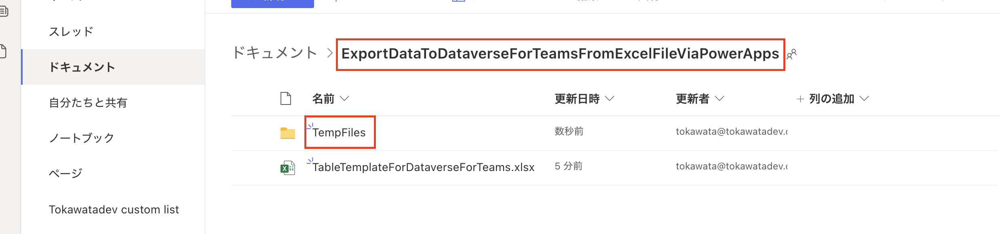
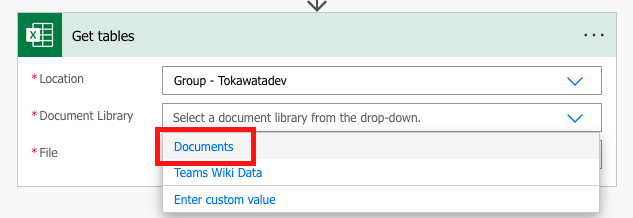
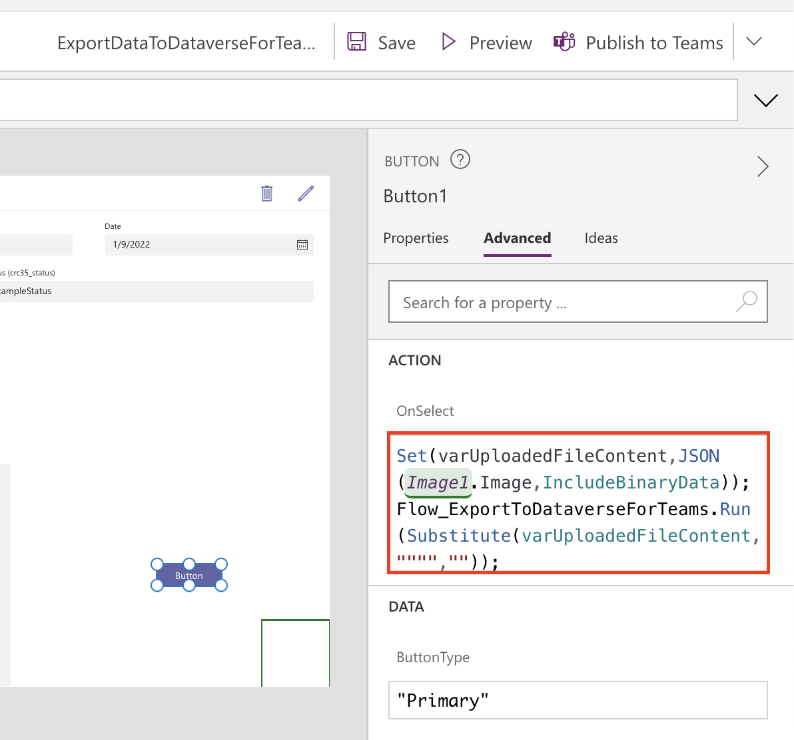

# ローカル PC にある Excelファイルをファイル選択ダイアログで指定し、Excel ファイルのテーブル内にあるレコードを Dataverse for Teams へ追加する Power Apps アプリケーションの作成 

## このドキュメントの内容
Excel ファイル内のテーブルのレコードを、既存の Dataverse for Teams へ追加する Power Apps アプリケーションの作成手順 (非公式) です。 Excel ファイルはローカル PC 上にあるものをファイル選択ダイアログで指定することができるようにしています。 

Power Apps の知見がなくとも実装出来るようスクリーンショットを盛りに盛っています。

## 前提
- 使用する Excel ファイルがテーブルを持っている事
- Teams を使用できる権利を含む Microsoft 365 のライセンスを持っている事
- 追加コストを抑えるべく Microsoft 365 ライセンスのみで実現させたい都合上、Dataverse for Teams を使用します
- macOS を使用している都合上、スクリーンショットは macOS のものです。 (他 OS も Power Apps がサポートされている OS やブラウザをご利用の場合は同手順で実現可能と思われます。)

## 実装するアプリケーションの動作
1. [Power Apps] ボタンクリックにより添付ファイル コントロールのファイル選択ダイアログを起動
2. [Power Apps] 画像コントロールを媒介として Excel ファイルを Datauri 型のデータへ変換
3. [Power Automate] Datauri 型のデータを Excel ファイルに復元、テーブルを取得
4. [Power Automate] テーブルの内容を Dataverse for Teams へ追加

## 実装
以下実装内容です。

## 0. Dataverse for Teams へアップロードする Excel ファイルと Dataverse の準備
### 0.1 Excel ファイルの準備
まず初めに、Dataverse for Teams へ追加するデータの元となる Excel ファイルを準備します。

> Power Automate のフローを設定する際、どこからどこまでのデータを Dataverse for Teams へ追加するかを指定するためにテーブルを設定します。

ファイル名は `TableExampleForDataverseForTeams.xlsx` としました。

作成したファイル内に、表とレコードを作成します。出張を想定して以下の項目としました。
- Title
- Requester
- Date
- Details
- Status

元データができたので、これをテーブルにします。データを選択した後、「ホーム」タブの「テーブルとして書式設定」を選択する事でデータをテーブルに指定します。

以下のダイアログが出てきたのでそのまま OK を押します。

Excelのテーブルとなりました。

このままでも良いのですが、Power Automate からテーブルを指定する必要があるので、テーブル名を決めておきます。「テーブルデザイン」タブよりテーブル名を指定できます。`TravelRequestForm` としました。

Excel ファイルの中にテーブルを用意できました。

SharePoint 上に `ExportDataToDataverseForTeamsFromExcelFileViaPowerApps` というフォルダを作成し、そこに保存しておきます。

> Power Automate のフロー自体には関係ないですが、フロー作成の際に Dataverse for Teams の列名と、上記で作成したテーブル `TravelRequestForm` の列の対応づけを行うために SharePoint 上へアップロードしておくとスムーズにフローを作成出来るので、SharePoint へのアップロードをお勧めします。
  \
  \
このドキュメントでは、`TableExampleForDataverseForTeams.xlsx` を SharePoint へアップロードを行っている前提で説明を進めます。

### 0.2 Dataverse for Teams の準備
次に、データの追加先の Dataverse for Teams を用意します。

Teams の 「...」タブより、Power Apps を検索して選択します。

「Build」タブより、「See all」を選択します。

Power Apps の一覧画面が表示されます。Power Apps でアプリケーションを作成された事がある方にはお馴染みの画面ですね。私はあれこれ試してしまっているので過去のフローやテーブルが一覧に見えています。

Dataverse for Teams を作成するために、Power Apps アプリケーションを作成します。今回はローカル PC からのファイル アップロードを想定しているので、横長の画面である「Tablet form factor」を選択しました。

Power Apps アプリケーションが新規で作成されるので、名前をつける必要があります。この Git リポジトリの名前を設定しました。

Dataverse for Teams を設定するためには、開始した画面の「With data」をクリックし、「Create new table」を選択します。

`TravelRequest` という名前を設定しました。

`TravelRequest` と言う名前の Dataverse for Teams が設定されました。データを編集できる画面になります。0.1 で Excel ファイルに指定した項目 (Title, Requester, Date, Details, Status) と、例としてその項目に対するレコードを追加して「Close」を押すと次のようになります。

## 1. [Power Apps] ボタンクリックにより添付ファイル コントロールのファイル選択ダイアログを起動
Power Apps アプリケーションに添付ファイルをアップロードさせる機能を作成します。

左ペインには `RightContainer1` があると思います。今回は 1 レコードに対するデータ項目が少ないので、この画面で簡潔させるべく `RightContainer1` をクリックし、下幅を狭めてボタンを追加するスペースを用意します。

ボタンを追加します。

添付ファイル コントロールを追加するため、まず Edit Form (編集フォーム) を追加します。

次に、添付ファイル コントロールを追加するため、任意の SharePoint リストを作成します。

> ここで SharePoint リストを作成する理由ですが、私が手元で試した際 Teams 上の Power Apps から添付ファイル コントロールを獲得する方法が SharePoint リストを Data source とした Edit form から取り出す方法のみ見つけられたため、この手順を追加しました。他にも良い方法があると信じたいです。

添付ファイル コントロールを追加した後は使いませんが、`TravelRequestList` としました。リストの中身は空で構いません。

作成した `TravelRequestList` を参照するため、左ペインの「Add data」より SharePoint を検索します。

すると下の図のように、Power Apps と連携する SharePoint を選択可能となります。

選択すると、今度はどのリストのデータを参照するかを問われます。ここで先程作成した `TravelRequestList` を選択します。

最後に、先に追加しておいた編集フォームを選択し、「Data source」より `TravelRequestList` を選択すると添付ファイルコントロールが付属した Edit form が得られます。

Edit form のみ必要なので左ペインの添付ファイル コントロールを選択後、Command (または Control) + C を押下してクリップボードへコピーします。(画像内 `DataCardValue2`)

クリップボードへコピーしたまま、左ペイン `Screen1` を選択し、Command (または Control) + V にて `Screen1` 上に添付ファイル コントロールを貼り付けます。

添付ファイル コントロールを得られたため、Edit form は不要なので左ペインより削除します。

添付ファイル コントロールとボタンの位置を他と重ならないように配置し直しました。

Edit form より無理やり添付ファイル コントロールを取り出し、`Screen1` へ貼り付けたため、App Checker より 7 件のエラーが出ていますのでこれを削除します。

削除方法としては、エラーをクリックすると不正な式の内容が出てくるので、全件式を削除します。

添付ファイルコントロールの名前を変更します。`AttachmentControl1` としました。

## 2. [Power Apps] 画像コントロールを媒介として Excel ファイルを Datauri 型のデータへ変換

Datauri 型のデータを取り出すために媒介とする画像コントロールを設定します。デフォルトでは `Image1` となりました。

`Image1` を選択し、Image プロパティに `Last(AttachmentControl.Attachments).Value` と入力します。
> `AttachmentControl.Attachments` は「添付ファイル コントロールで内部的に作成される添付ファイルのテーブル」、`Last(AttachmentControl.Attachments)` で「添付ファイル コントロールで内部的に作成される添付ファイルのテーブルの最後のレコード」、`Last(AttachmentControl.Attachments).Value` で「添付ファイル コントロールで内部的に作成される添付ファイルのテーブルの最後のレコードが指し示すファイルそのものの値」と認識しています。

右上の Preview ボタンより添付ファイルコントロールより動作を確認します。

試しに 0.1 で作成した `TableExampleForDataverseForTeams.xlsx` を添付してみました。添付ファイル コントロールにより添付されています。

## 3. [Power Automate] Datauri 型のデータを Excel ファイルに復元、テーブルを取得
### 3.1 トリガーの作成

上記 2. にて添付したファイルを Power Automate により処理するため、Teams の Power Apps タブ (タブがない場合は検索) より New -> Cloud flow -> Instant よりクラウド フローを作成します。

トリガー として 「Power Apps」を選択すると、Power Automate のフローの作成画面となります。

### 3.2 SharePoint に一時ファイルの作成
今回は Dataverse for Teams へテーブル内のデータを追加する事がゴールではありますが、一度 Power Apps からアップロードする添付ファイルの中身を読み込むため、一時的にアップロードしたファイルをExcel ファイルとして SharePoint 上へ配置します。そのためのアクションとして、SharePoint コネクタの「Create file」を選択します。

Site Address にはドロップダウンより自身の SharePoint の URL を、Folder Path には `ExportDataToDataverseForTeamsFromExcelFileViaPowerApps` 下に `TempFiles` と言う一時的なファイルを格納するためのフォルダを作成し、フォルダのアイコンより TempFiles を指定します。

このファイルは Dataverse for Teams へエクスポートするために生成される一時的なもののため、命名はユニークでさえあれば良いため時間を設定します。「Add dynamic content」より「utcnow」と検索すると候補に「utcNow」が出てくるので、選択します。

Excel ファイルを生成したいので、「File Name」に Excel ファイルの拡張子「.xlsx」を追加します。

「File Content」には、先程画像コントロールを媒介として取り出した Datauri 型のデータをバイナリデータへ戻し、Excel ファイルとするため「dataUriToBinary」を選択します。

また、「dataUriToBinary」には、「Dynamic content」から得られる「Createfile_FileContent」を設定します。

これにより、添付ファイルとしてアップロードされた Excel ファイルを SharePoint 上へ保存するまでのフローができました。

### 3.3 ファイルからテーブルを獲得する
次のステップでは、テーブルを獲得します。Excel Online のコネクタより「Get tables」を指定します。

「Location」にはドロップダウンより「Group - < SharePoint 名>」を、「Document Library」には「Documents」を、「File」には「Add dynamic content」より SharePoint の「Id」を設定します。

### 3.4 テーブルよりレコードを獲得する
次のステップとして、「Apply to each」を選択します。

> 「Get tables」では下記のリファレンスにもあるように、戻り値としてテーブルの配列が指定されています。1 ファイル内にある複数のテーブルを取れるようにデザインされているからです。今回は 1 テーブルしか使用しませんが、この配列からテーブルを受け取るため 「Apply to each」を選択します。
  \
  \
テーブルを取得する - Excel Online (Business)
https://docs.microsoft.com/ja-jp/connectors/excelonlinebusiness/#%E3%83%86%E3%83%BC%E3%83%96%E3%83%AB%E3%82%92%E5%8F%96%E5%BE%97%E3%81%99%E3%82%8B

「*Select an output from previous steps」には、「Add dynamic content」より Excel Online の「Value」を選択します。

これにより、次の処理に「Apply to each」により取り出されたテーブルの配列の要素 (つまり Excel ファイルより取り出したテーブルそのもの) を渡す事ができます。

次に、「Add an action」より「Apply to each」を選択します。「Apply to each」の中に「Apply to each」がある状態です。

「*Select an output from previous steps」には、再度「Add dynamic content」より Excel Online の「Value」を選択します。

手順としては先程行った内容と同じですが、この手順により次の処理に「Apply to each」により取り出されたテーブル内にある要素 (つまりテーブル内の 1 行が表すレコード) を渡す事が出来ます。

「Apply to each 2」の「Add an action」より Excel Online の「List rows present in table」を選択します。

「Location」にはドロップダウンより「Group - < SharePoint 名>」を、「Document Library」には「Documents」を、「File」には「Add dynamic content」より SharePoint の「Id」を設定します。

「Table」には取り出したいテーブル名 `TravelRequestForm` を直接入力します。

また、私は Dataverse for Teams の `TravelRequest` の 「Date」列は日付のフォーマットを選択しています。

日付入力を受け付けるようにするため、「Show advanced options」より「DateTime Format」を「ISO 8601」を選択します。

## 4. テーブルの内容を Dataverse for Teams へ追加

最後に、Dataverse へレコードの追加を行うため「Add an action」より「Microsoft Dataverse」の「Add a new row」を追加します。

「Table name」には、0.2 で準備した Dataverse for Teams `TravelRequest` を設定します。

「Show advanced options」を選択し、Dataverse for Teams へレコードを追加するためのオプションを展開します。

展開すると、`TravelRequest` の列名がそれぞれオプションに表示されているのが見えます。これより、テーブルから獲得した内容をこれらに追加する対応づけを行います。

> ❗️ここから、`TravelRequest` に作成した列と Excel ファイル内のレコードの対応づけを行うため、これまでに作成した正しいフローを一時的に変更します。

「List rows present in table」の「File」に指定した SharePoint の「ID」を削除します。
 

そして、フォルダ アイコンより 0.1 にて作成した `TableExampleForDataverseForTeams.xlsx` を指定します。

> この手順を行う事で、Power Automate が `TableExampleForDataverseForTeams.xlsx` 内のテーブル `TravelRequestForm` を読み込めるようになるので、対応づけを行う際に列名を候補として得る事が出来ます。

Power Automate が `TravelRequestForm` の内容を読み込み、列との対応づけが出来るようになりました。

実際に対応づけを行った図です。

対応づけが終了したので、先程一時的に変更した
「List rows present in table」の「File」に、再度 SharePoint の「ID」を設定し正しいフローへ復元します。

以上でフローの作成は終了です。フローには日本語名前が自動で付与されているため、名前を `Flow_ExportToDataverseForTeams` として右上の「Save」ボタンより保存します。

最後に、作成したフロー `Flow_ExportToDataverseForTeams` を Power Apps のボタンをトリガーとして呼び出すよう設定します。

再度 Power Apps の編集画面を開きます。

`Button1` を選択し、上部のドットメニューより「Power Automate」を選択します。

作成したフロー `Flow_ExportToDataverseForTeams` を選択します。

`Button1` の「OnSelct」の内容を下記に設定します。

`Set(varUploadedFileContent,JSON(Image1.Image,IncludeBinaryData));
Flow_ExportToDataverseForTeams.Run(Substitute(varUploadedFileContent,"""",""));`

これでアプリケーションは完成です。

右上のプレビューボタンより `TableExampleForDataverseForTeams.xlsx` をアップロードしてみます。

フローが走り、Teams のタブを切り替える等を行ってアプリの画面の更新を行うと、あらかじめ `TableExampleForDataverseForTeams.xlsx` に登録していたレコードが追加されている事が確認できます。

本ドキュメントが何かの役に立てば幸いです。

Toxumuharu

## 参考文献
- https://mofumofupower.hatenablog.com/entry/2020/12/03/100000

## Special thanks
- 私が所属しているカイシャの先輩 N さん
